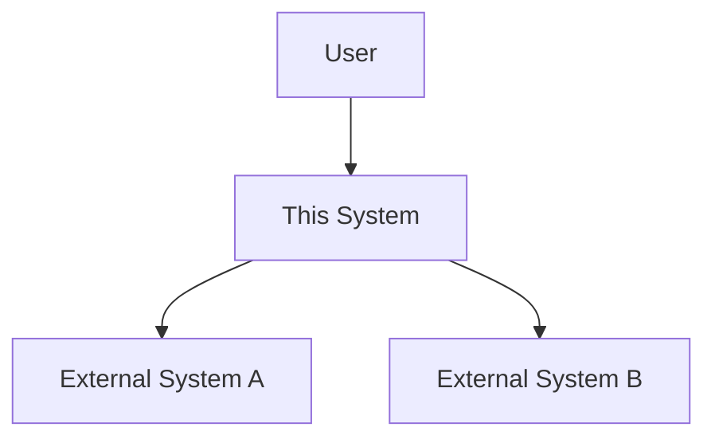
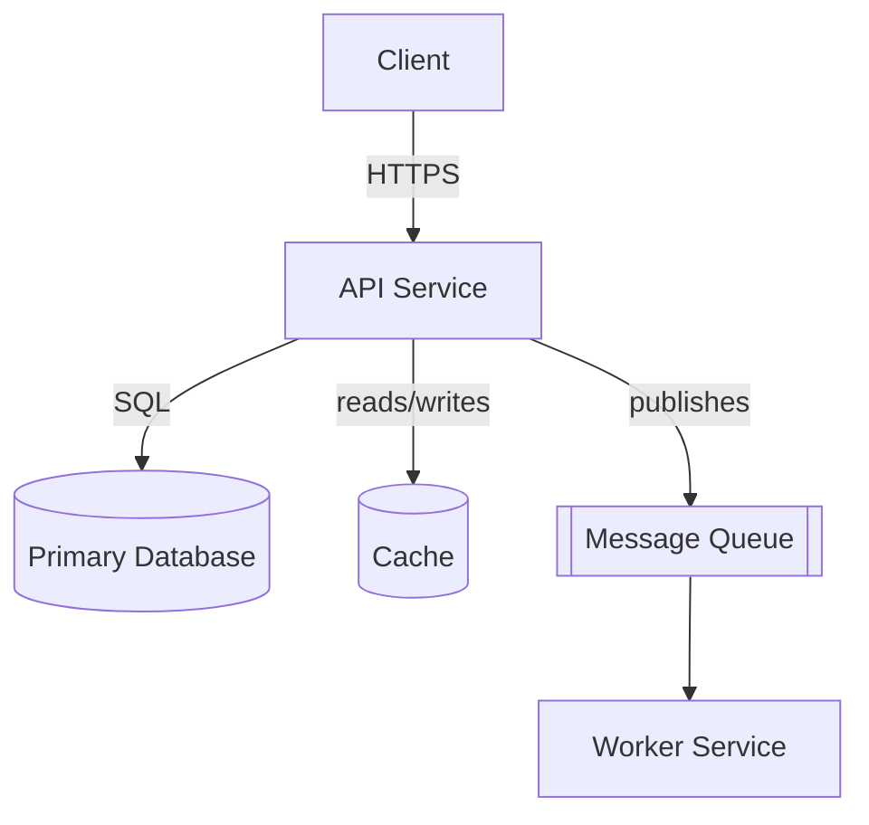

# Architecture

> Condensed arc42 + C4. Not the full 12-section arc42 — just enough to orient a
> newcomer and inform decisions. Keep diagrams as code (Mermaid) so they stay
> reviewable and live alongside the system they describe.

## System context (C4 level 1)

<!-- Who/what interacts with the system, and the external systems it depends on.
     Replace the nodes below with real actors/systems. -->

## Containers (C4 level 2)

<!-- The deployable units: services, apps, datastores, queues. Replace with the
     real containers and how they talk (sync/async, protocol). -->

## Components (C4 level 3) — optional

<!-- Only add this for containers complex enough to warrant it (e.g. a service
     with several internal modules). Delete this section if not needed yet. -->

TODO (add only if a container needs internal breakdown)

## Key runtime / data flows

<!-- Narrative walkthroughs of the important flows, e.g. "user signup",
     "payment processing". Keep these short; link to code for detail. -->

- TODO

## Cross-cutting concerns & constraints

<!-- Auth, observability, rate limiting, multi-tenancy, performance/scale
     constraints, anything that cuts across containers. -->

- TODO
