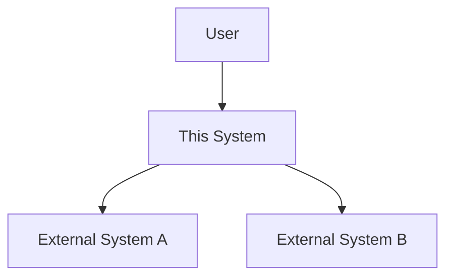
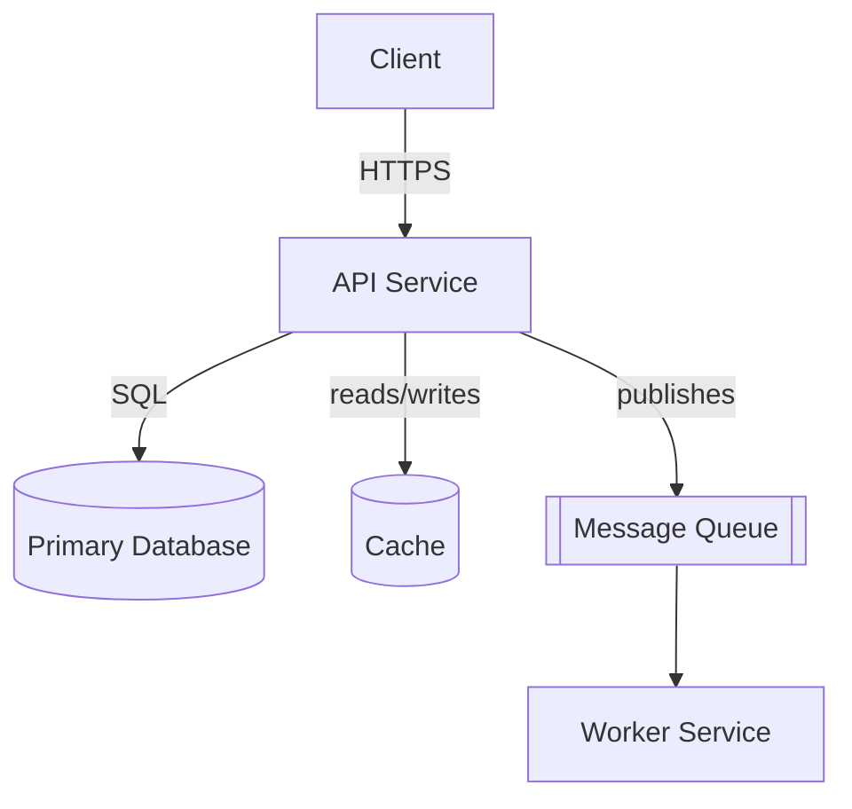

# Architecture

> Condensed arc42 + C4. Not the full 12-section arc42 — just enough to orient a
> newcomer and inform decisions. Keep diagrams as code (Mermaid) so they stay
> reviewable and live alongside the system they describe.

## System context (C4 level 1)

<!-- Who/what interacts with the system, and the external systems it depends on.
     Replace the nodes below with real actors/systems. -->

## Containers (C4 level 2)

<!-- The deployable units: services, apps, datastores, queues. Replace with the
     real containers and how they talk (sync/async, protocol). -->

## Components (C4 level 3) — optional

<!-- Only add this for containers complex enough to warrant it (e.g. a service
     with several internal modules). Delete this section if not needed yet. -->

TODO (add only if a container needs internal breakdown)

## Key runtime / data flows

<!-- Narrative walkthroughs of the important flows, e.g. "user signup",
     "payment processing". Keep these short; link to code for detail. -->

- TODO

## Cross-cutting concerns & constraints

<!-- Auth, observability, rate limiting, multi-tenancy, performance/scale
     constraints, anything that cuts across containers. -->

- TODO

## Quality requirements

<!-- arc42 section 10. The qualities this system must have, in priority order,
     each with a concrete scenario that makes it testable. Top 3-5 maximum —
     a quality goal nobody measures is a wish, not a requirement. Example:

     | Quality | Scenario (testable) | Priority |
     |---|---|---|
     | Latency | p99 API read < 200ms at 100 rps | 1 |
     | Durability | No acknowledged write lost across a single-node failure | 2 | -->

- TODO

## Risks & technical debt

<!-- arc42 section 11. Known problems, risks, and deliberate shortcuts — with
     their mitigation or payoff date. This is the honest section: an empty list
     here usually means nobody wrote it down, not that nothing exists. Review
     in `update-docs` runs; retire entries when resolved or consciously
     accepted. Example:

     | Risk / debt | Impact | Mitigation / payoff |
     |---|---|---|
     | No retry queue on email provider | transient email loss | add queue by Q3 |
     | Legacy parser lacks tests | regressions hard to catch | characterization tests before any change | -->

- TODO
